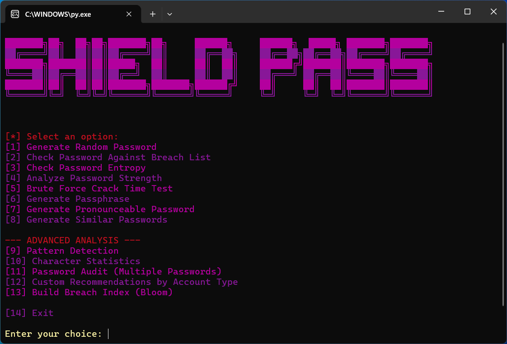

# 🛡️ ShieldPass

A comprehensive Python password security tool featuring secure password generation, strength analysis, breach database checking, and detailed security metrics with colorful terminal output.

## ✨ Features

- **🔐 Secure Password Generation**
  - Cryptographically secure random password generation
  - Customizable character sets (lowercase, uppercase, digits, special characters)
  - Pronounceable password creation for easier memorization
  - Passphrase generation with customizable word count

- **📊 Advanced Strength Analysis**
  - Shannon entropy calculation
  - Pattern detection (sequences, repetitions, keyboard patterns)
  - Dictionary attack resistance checking
  - zxcvbn integration for realistic strength estimation
  - Time-to-crack estimation

- **🚨 Breach Database Checking**
  - Check passwords against rockyou.txt breach database
  - k-anonymity implementation for privacy
  - Bloom filter support for fast lookups
  - Find similar compromised passwords

- **🎨 User-Friendly Interface**
  - Colorful terminal output with ANSI colors
  - Clear security level indicators
  - Detailed vulnerability reports
  - Interactive menu system

## 📋 Requirements

- Python 3.7+
- `zxcvbn` (optional, for enhanced strength analysis)

## 🚀 Installation

1. Clone the repository:
```bash
git clone https://github.com/Usero0/shieldpass.git
cd shieldpass
```

2. Install dependencies:
```bash
pip install zxcvbn
```

3. (Optional) Add wordlists for enhanced features:
   - **rockyou.txt** - for breach checking (14M+ compromised passwords)
   - **passphrase.txt** - for passphrase generation (wordlist with common words)
   
   Place both files in the project directory.

## 💻 Usage

Run the program:
```bash
python main.py
```



### Example: Generate Password

```bash
$ python main.py
# Select option 1
# Choose length (e.g., 16)
# Select character types
# Get your secure password!
```

### Example: Analyze Password

```bash
$ python main.py
# Select option 2
# Enter password to analyze
# View detailed security report including:
#   - Strength level
#   - Entropy score
#   - Pattern analysis
#   - Breach status
#   - Time to crack estimation
```

## 🔒 Security Features

### Entropy Calculation
Measures password randomness using Shannon entropy formula:
- **Very Weak**: < 28 bits
- **Weak**: 28-35 bits
- **Fair**: 36-59 bits
- **Good**: 60-127 bits
- **Excellent**: ≥ 128 bits

### Pattern Detection
Identifies common vulnerabilities:
- Sequential characters (abc, 123)
- Repeated characters (aaa, 111)
- Keyboard patterns (qwerty, asdf)
- Common words and substitutions

### Breach Checking
- Searches rockyou.txt database (14M+ passwords)
- Privacy-preserving k-anonymity approach
- Fast Bloom filter lookups
- Finds similar compromised variations

## 📦 Project Structure

```
shieldpass/
├── main.py              # Main application
├── README.md            # Documentation
├── LICENSE              # MIT License
├── .gitignore           # Git ignore rules
└── examples/            # Usage examples
    ├── basic_usage.py
    └── breach_checking.py

# Optional files (not included in repository):
├── rockyou.txt          # Breach database for checking compromised passwords
└── passphrase.txt       # Wordlist for passphrase generation
```

## 🎯 Why ShieldPass?

- **Secure**: Uses Python's `secrets` module for cryptographic randomness
- **Comprehensive**: Multiple analysis methods for thorough security assessment
- **Privacy-Focused**: k-anonymity for breach checking
- **Educational**: Learn about password security principles
- **Fast**: Bloom filters and efficient algorithms

## 🤝 Contributing

Contributions are welcome! Feel free to:
- Report bugs
- Suggest features
- Submit pull requests

## 📄 License

This project is licensed under the MIT License - see the [LICENSE](LICENSE) file for details.

## ⚠️ Disclaimer

This tool is for educational and personal security purposes. Always use strong, unique passwords for each account and consider using a password manager.

## 📚 Learn More

- [NIST Password Guidelines](https://pages.nist.gov/800-63-3/)
- [OWASP Password Security](https://owasp.org/www-community/password-special-characters)
- [Have I Been Pwned](https://haveibeenpwned.com/)

## 💰 Support the Project

If you find ShieldPass useful and want to support its development, you can send a donation to one of these cryptocurrency addresses:

**Bitcoin (BTC)**
```
bc1qr4dtngl00cl7wcm3kaglyt624w2wp6rk0j8sn5
```

**Ethereum (ETH)**
```
0x84b867DE6f369b75054Be91E98Ad8EBa6F5C5A57
```

**Solana (SOL)**
```
HUyxkPgF2ZTuAuihZmop1AGKBJZVZG5N4iUZMVurQ7oM
```

Any contribution, no matter how small, is greatly appreciated! 🙏

---

Made with 💜 by [Usero0](https://github.com/Usero0)
